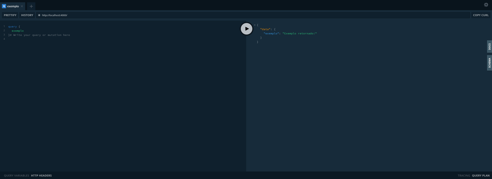

# GraphQL
[Apollo GraphQL](https://www.apollographql.com/docs/)

[Apollo Server Documentação](https://www.apollographql.com/docs/apollo-server/)

[GraphQL Documentação](https://graphql.org/)

- [GraphQL](#graphql)
  - [Instalando](#instalando)
  - [Basico](#basico)
    - [TypeDefs](#typedefs)
    - [Resolvers](#resolvers)
    - [ApolloServer](#apolloserver)
    - [Iniciando servidor](#iniciando-servidor)
          - [output do código funcional.](#output-do-código-funcional)
      - [Promise retornado do server.listen](#promise-retornado-do-serverlisten)
      - [Esquema Básico](#esquema-básico)
      - [No navegador](#no-navegador)
  - [Tipos](#tipos)
    - [Scalar](#scalar)
    - [Tipo Customizável](#tipo-customizável)

## Instalando
Para começar uma das formas é tendo o npm com o node js instalado e: `npm install graphql` e `npm install apollo-server`, e claro se for o caso `npm install nodemon` para ambientes de desenvolvimento. Com os pacotes instalado bastar usar o `npm start` e inicializar tudo.

## Basico
[basico](basico.js)

    const {ApolloServer,gql} = require('apollo-server');
    const typeDefs = gql `
        #Pontos de entrada da API
        type Query{
            exemplo:String
            hoje:String
        }
    `;

    const resolvers = {
        Query:{
            exemplo(){
                return "Exemplo retornado!"
            },
            hoje: () => new Date().toDateString()
        }
    };

    const server = new ApolloServer({
            typeDefs,
            resolvers
    });

    server
        .listen()
        .then(param => 
            {
                console.log(`
                    url: ${param.url},
                    address: ${param.address}, 
                    family: ${param.family},
                    port: ${param.port},
                    server: ${param.server},
                    subscriptionsPath: ${param.subscriptionsPath},
                    subscriptionsUrl: ${param.subscriptionsUrl}
                `);    
            }
        );

**Esse é o código mínimo para que o **GraphQL** funcione.**
### TypeDefs

    const typeDefs = gql `
        #Pontos de entrada da API
        type Query{
            exemplo:String
            hoje:String
        }
    `;

O `gpl` veio importado de `require('apollo-server')`, e o **gpl** é um *template string*, que formata a expressão para o **GraphQL**. No caso com o **Type Query** criamos o tipo de dados mais básicos que são as queries, [mais informações](https://graphql.org/learn/). No caso a estrutura seria `nome`**:**`tipo`. Os `TypeDefs` são passados como argumentos para o objeto `ApolloServer`. Aqui ocorre a definição dos tipos e a definição de estruturas.

>Documento ou documentos que representam o esquema GraphQl do seu servidor, gerado aplicando a tag GQL para strings válidos de definição de esquema (SDL).
### Resolvers

    const resolvers = {
        Query:{
            exemplo(){
                return "Exemplo retornado!"
            },
            hoje: () => new Date().toDateString()
        }
    };

Aqui nessa parte as variáveis dentro de `typeDefs` são resolvidas, no caso as funções definidas aqui são relacionadas aos `TypeDefs`, no caso a função `exemplo(){return "Exemplo retornado!"}` resolve o valor `exemplo:String` e no caso a função `() => new Date().toDateString()` é definida a `hoje:String`.

>Um mapa de funções que preenchem dados para campos de esquema individuais.Também pode ser uma matriz de vários mapas que são mesclados.
### ApolloServer

    const server = new ApolloServer({
            typeDefs,
            resolvers
    });

Aqui é assimilado os typeDefs e os resolvers, ambos os valores são o mínimo necessário para que tudo funcione.

### Iniciando servidor

    server
        .listen()
        .then(param => 
            {
                console.log(`
                    url: ${param.url},
                    address: ${param.address}, 
                    family: ${param.family},
                    port: ${param.port},
                    server: ${param.server},
                    subscriptionsPath: ${param.subscriptionsPath},
                    subscriptionsUrl: ${param.subscriptionsUrl}
                `);    
            }
        );

Aqui é aonde ocorre a execução do código tendo o seguinte output:

###### output do código funcional.

    url: http://localhost:4000/,
    address: ::,
    family: IPv6,
    port: 4000,
    server: [object Object],
    subscriptionsPath: /graphql,
    subscriptionsUrl: ws://localhost:4000/graphql

#### Promise retornado do server.listen
No código acima temos a `URL` que retorna a url completa aonde está o recurso, o address retorna o endereço ip, no caso do IPV6 retorna `::` para *localhost*, *family* faz referência ao protocolo usado, nesse caso o **IPV6**, `port` é a porta que será usada, o padrão se omitido é a porta `4000`, no caso se quiser especificar uma porta, você pode definir isso aqui `server.listen([porta])`, sendo aonde você deve colocar `[porta]` a porta `tcp` que você quer destinar a isso. `subscriptionsPath` e `subscriptionsUrl`, retorna uma url de subscrição, ao passo que `server` contém funcionalidades, para interagir com as requisições enviadas.

#### Esquema Básico
[Documentação Completa](https://www.apollographql.com/docs/apollo-server/schema/schema/)

>Seu servidor GraphQL usa um esquema para descrever a forma do seu gráfico de dados. Este esquema define uma hierarquia de tipos com campos que são preenchidos a partir de suas lojas de dados de back-end. O esquema também especifica quais queries e mutações estão disponíveis para clientes para executar o seu gráfico de dados.

#### No navegador

Você pode informar a coluna esquerda a seguinte query abaixo e clicar no botão de play:

    query {
        exemplo
        hoje
    }

OU

    {
        exemplo
        hoje
    }

Dentro das chaves você informa os recursos que você quiser, por padrão se assume o tipo query ou seja `query{}` e `{}` tem a mesma funcionalidade, pois query é o padrão. Além disso você pode informar parcialmente o que quer, inclusive esse é um dos diferenciais do **GraphQL** para o **REST**, sendo também válido só `{exemplo}` ou só `{hoje}`, porém dessa forma apenas será retornado o recurso solicitado.

## Tipos
[Tipos código](tipos.js)

    const {ApolloServer,gql} = require('apollo-server');
    const typeDefs = gql `
        #Pontos de entrada da API
        type Query{
            id:ID
            int:Int
            float:Float
            boolean:Boolean
            string:String
        }
    `;

    const resolvers = {
        Query:{
            id: () => 1,
            int: () => 3232,
            float: () => 10.50,
            boolean: () => true,
            string: () => "texto"
        }
    };

    const server = new ApolloServer({
            typeDefs,
            resolvers
    });
    server
    .listen(4004)
    .then(param => 
        {
            console.log(`
                url: ${param.url},
                address: ${param.address}, 
                family: ${param.family},
                port: ${param.port},
                server: ${param.server},
                subscriptionsPath: ${param.subscriptionsPath},
                subscriptionsUrl: ${param.subscriptionsUrl}
            `);             
        }
    );

**Sobre tipos, temos os seguintes padrões:**

    ...
    const typeDefs = gql `
        #Pontos de entrada da API
        type Query{
            id:ID
            int:Int
            float:Float
            boolean:Boolean
            string:String
        }
    `;
    ...

O `GraphQL` trabalha com 5 tipos de dados básicos, no caso o tipo `ID` é o tipo identificador, `int` número inteiro, `float` número decimal, `boolean` para tipos booleanos, `string` para tipos de textos, sendo possível criar um tipo customizável se esses não forem o suficiente. Importante salientar, os tipos começam com a primeira letra em maíusculo, sendo o tipo `ID` inteiro em letra de forma e o inteiro sendo representado por `Int`, outra coisa, `!` após o tipo significa que o atributo é obrigatório, por exemplo se o campo **id** fosse obrigatório, bastaria adicionar uma exclamação no tipo, por exemplo `id:ID!`. No exemplo abaixo as variáveis que possuem todos os caracteres em minusculos do exemplo acima, sendo resolvidas:

    const resolvers = {
        Query:{
            id: () => 1,
            int: () => 3232,
            float: () => 10.50,
            boolean: () => true,
            string: () => "texto"
        }
    };

Esse exemplo é executado em uma porta diferenta, no caso na porta `4004`:

    server
    .listen(4004)
    .then(param => 
        {
            console.log(`
                url: ${param.url},
                address: ${param.address}, 
                family: ${param.family},
                port: ${param.port},
                server: ${param.server},
                subscriptionsPath: ${param.subscriptionsPath},
                subscriptionsUrl: ${param.subscriptionsUrl}
            `);             
        }
    );

Sendo definido aqui `.listen(4004)`. No navegador ao passar a query `{id, int, float, boolean, string}`, temos:

    {
        "data": 
        {
            "id": "1",
            "int": 3232,
            "float": 10.5,
            "boolean": true,
            "string": "texto"
        }
    }

### Scalar
[Scalar arquivo](scalar.js)

    ...
    const typeDefs = gql `        
        scalar MinhaData
        type Query{
            id:ID!                        
            string:String
            data:MinhaData
        }
    `;
    ...
>repara que o id aqui é obrigatório `id:ID!`

Repare esse campo `scalar MinhaData`, aqui estamos definindo um novo tipo, que no caso está sendo usado aqui `data:MinhaData`, que no caso está sendo usado para definir o `data`, nesse caso, esse tipo de dados **scalar** é genérico e aceita qualquer coisa, conforme visto abaixo:

    ...
    const resolvers = {
        Query:{
            id: () => parseInt(Math.random() * 99),
            string: () => "String retornada.",
            data: () => new Date
        }
    }
    ...

No caso esse dado criado é resolvido aqui `data: () => new Date`. Mas lembre-se o scalar aceita qualquer tipo de dados, seria o tipo `any` das linguagens de programação. Qury para o navegador abaixo: 

    {
        id string data
    }

No caso nesse exemplo é renderizado, porém é valido lembrar que o ID é randomico alem de obrigatório: `parseInt(Math.random() * 99),`:

    {
        "data": 
        {
          "id": "76",
          "string": "String retornada.",
          "data": "2021-06-03T20:28:24.791Z"
        }
    }

### Tipo Customizável
[Type](type.js)

    ...
    const typeDefs = gql `        
        type Pessoa{
            identity:ID
            nome:String
        }
        
        type Query{
            id:ID!                                    
            pessoa:Pessoa
        }
    `;
    ...

Você pode perfeitamente criar um tipo, nesse caso, diferente do *scalar*, você pode definir a estrutura dos dados. No caso você pode criar um tipo de dado chamado `Pessoa`, que é composto facultativamente de um `ID` e um nome, sendo os tipos `ID` e `string` respectivamente. A sintaxe para a criação de tipo é essa `type [SEUTIPO]{}` e para usar você pode usar em qualquer lugar da query, conforme visto aqui `pessoa:Pessoa`. No caso abaixo temos um exemplo de uma query a ser informada:

    {
        id pessoa{identity nome}
    }

Repare que caso você queria pegar dados do tipo pessoa você precisa informar o que você quer pegar de pessoa, conforme visto aqui `pessoa{identity nome}`, no caso é pego o `identity` e o `nome` da estrutura `pessoa`. Assim temos o seguinte output:

    {
        "data":
        {
            "id": "93",
            "pessoa": {
                "identity": "15",
                "nome": "Da Silva"
            }
        }          
    }

Segue o seguinte resolver:

    const resolvers = {        
        Query:{
            id: () => parseInt(Math.random() * 99),                        
            pessoa: () => (
                {
                    identity:parseInt(Math.random() * 99),
                    nome: "Da Silva"
                })
        }
    }

Repare que a pessoa acima é resolvida como um objeto, que retorna um número aleatório e uma string fixa.