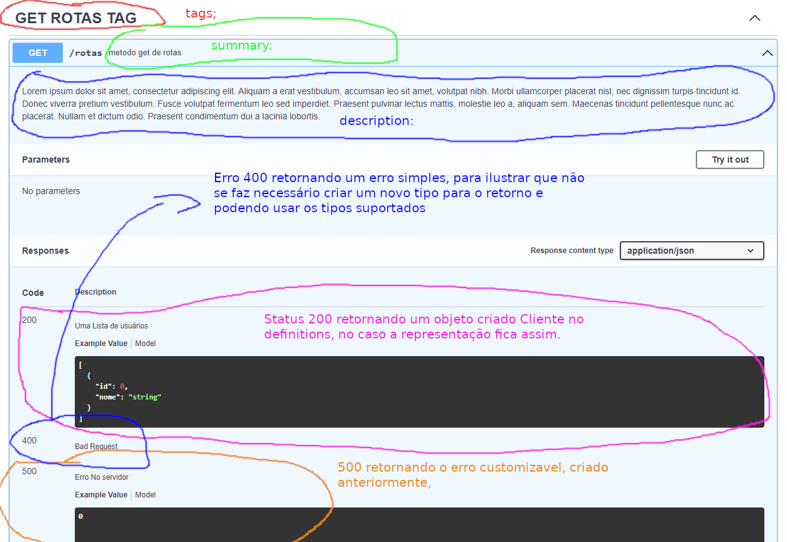
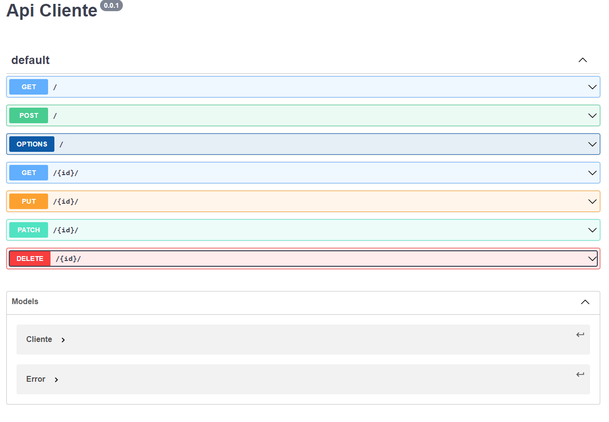

# Api REST

## Api REST com o Swagger
[Swagger](https://swagger.io)

[Documentação do Swagger](https://swagger.io/docs/)

[Api Versão 2](https://swagger.io/specification/v2/)

[Api Especificação atual](https://swagger.io/specification/)

### Exemplo apenas com os campos obrigatórios
[funcional](funcional.yaml)

    swagger: "2.0"
    info:
        title: Minha Api
        version: "0.0.1"
    paths:
        /rotas:
            get:
                responses:
                    default:
                    description: Problemas nas requisições

#### No YAML
No caso aqui temos o minimo para funcionar, aqui `swagger: "2.0"` especificamos a aplicação e a versão que usaremos para criar a nossa **API REST**. Info também é um campo obrigatório, ao qual você deve indicar obrigatório dentro dele o título e a versão da api, nesse caso `Minha APi` e `0.0.1`. Após isso temos os Path.

##### PATH Básico
Toda essa parte do *path* é obrigatória, na sua forma básica, o mesmo deve conter o método http a ser atendido, pelo menos o *get*, conforme ilustrado acima. Em cada método se faz necessário especificar as respostas, nessa, você deve conter os códigos *HTTP*, ou até mesmo o *default* caso você queira lidar de uma maneira mais genérica, além claro das descrições, representado por *description*.

#### Exemplo com o mínimo para funcionar, visual:

### Adicionando campos extras
[informativo](informativo.yaml)

    swagger: "2.0"
    info: 
        title: Minha Api
        description: Exemplo Api
        version: "0.0.1"
    contact: 
        name: Jotape 
        email: email@email.com
        url: http://meusite.com
    host: api.host.com
    schemes:
        - https
    basePath: /subdominio
    produces: 
        - application/json
    paths:
        /rotas:
            get:
            responses:
                default:
                description: Problemas nas requisições

#### Contatos
Você pode colocar um campo de contatos se for o caso, uma vez inserido e-mail e name são campos obrigatórios, além disso é possível colocar uma *url*:

    contact: 
        name: Jotape 
        email: email@email.com
        url: http://meusite.com

####  :schemes, :produces, :host e :basePath
Através do `host` você define o domínio alvo e com base no `basePath` você define um subdominio raiz caso tenha, ambos os campos não são obrigatórios e o `basePath` só é útil caso você use um diretório dentro de seu domínio. Em `:schemes` você define o protocolo que será usado, podendo ser usado: `http`, `https`, `ws`, `wss`, esse campo pode ser facilmente omitido, mas quanto mais informação tiver a sua API, melhor será a documentação e o código resultante. Para concluir, temos o campo `:produces`, que indica que tipo de resposta o servidor irá dar, o padrão se omitido é `application/json`, esse campo seria o equivalente a `Content-Type` de uma requisição *http*.

    host: api.host.com
    schemes:
        - https
    basePath: /subdominio
    produces: 
        - application/json

#### Output com contatos e outros campos extras acima:

### Definitions
[Definitions](definitions.yaml)

    swagger: "2.0"
    info:
        title: Minha Api
        description: Exemplo Api
        version: "0.0.1"
    contact:
        name: Jotape 
        email: email@email.com
        url: http://meusite.com
    host: api.host.com
    schemes:
        - https
    basePath: /subdominio
    produces: 
        - application/json
        - application/xml
    paths:
        /rotas:
            get:
            responses:
                default:
                    description: Problemas nas requisições
            
    definitions:
        Cliente:
            type: object
            properties:
                id:
                    type: integer
                    description: Identificador único do usuário.
                nome:
                    type: string
                    description: Nome do usuário.
        Error:
            type: object
            properties:
                code:
                    type: integer
                    description: Código do erro.
                message:
                    type: string
                    description: Mensagem referente ao erro.

#### Definitions
Aqui você cria tipos de dados customizáveis, para compor tipos mais complexo, funciona de maneira semelhante aos registros das linguagens de programação estruturadas. Um campo customizável deve ter um `type` para indicar o tipo, nesse caso temos um objeto, mas poderia ser um array, ou algum outro tipo de dados qualquer, além disso caso seja um objeto, devemos informar as propriedades.

##### Cliente

    Cliente:
        type: object
        properties:
            id:
                type: integer
                description: Identificador único do usuário.
            nome:
                type: string
                description: Nome do usuário.

Aqui temos um cliente que tem um `id` e um `nome`, o primeiro sendo do tipo inteiro e o segundo do tipo string, o interessante é modelar isso de acordo com as entidades, no caso cada um com a sua descrição cuja a importância é mais para fins de documentação.

##### Error

    Error:
        type: object
        properties:
            code:
                type: integer
                description: Código do erro.
            message:
                type: string
                description: Mensagem referente ao erro.
   
Algo análogo ocorre com o **Error**, porém a mesma tem propriedades diferentes, ambos poderão ser usados para compor o tipo de dados do PATH.

#### Imagem envolvendo definitions

### Paths

    swagger: "2.0"
    info:
        title: Minha Api
        description: Exemplo Api
        version: "0.0.1"
        contact:
            name: Jotape 
            email: email@email.com
            url: http://meusite.com
    host: api.host.com
    schemes:
        - https
    basePath: /subdominio
    produces: 
        - application/json
    paths:
        /rotas:
            get:
                summary: metodo get de rotas
                description: |
                    Lorem ipsum dolor sit amet, consectetur adipiscing elit. Aliquam a erat vestibulum, accumsan leo sit amet, volutpat nibh. Morbi ullamcorper placerat nisl, nec dignissim turpis tincidunt id. Donec viverra pretium vestibulum. Fusce volutpat fermentum leo sed imperdiet. Praesent pulvinar lectus mattis, molestie leo a, aliquam sem. Maecenas tincidunt pellentesque nunc ac placerat. Nullam et dictum odio. Praesent condimentum dui a lacinia lobortis.
                tags: 
                  - GET ROTAS TAG
                responses:
                    200:
                        description: Uma Lista de usuários
                        schema:
                            type: array
                            items:
                            $ref: '#/definitions/Cliente'
                    400:
                        description: Bad Request
                    500:
                        description: Erro No servidor
                        schema:
                            type: integer
                    default:
                        description: Problemas nas requisições
                        schema:
                            $ref: '#/definitions/Error'            
    definitions:
        Cliente:
            type: object
            properties:
                id:
                    type: integer
                    description: Identificador único do usuário.
                nome:
                    type: string
                    description: Nome do usuário.
        Error:
            type: object
            properties:
                code:
                    type: integer
                    description: Código do erro.
                message:
                    type: string
                    description: Mensagem referente ao erro.
#### PATH Imagem

#### summary, tags, description
Sumary deve ser uma breve descrição da página com o método em questão, a tags ajuda na organização e na criação de palavras chaves para *SEO*, já o description a idéia é que tenha uma explicação mais aprofundada.

#### responses dentro de paths

    responses:
        200:
            description: Uma Lista de usuários
            schema:
                type: array
                items:
                    $ref: '#/definitions/Cliente'
        400:
            description: Bad Request
        500:
            description: Erro No servidor
            schema:
                type: integer
        default:
            description: Problemas nas requisições
            schema:
                $ref: '#/definitions/Error' 

**Nesse exemplo abaixo, você não está retornando nada ao cliente, para fazer isso basta apenas colocar uma descrição:**

    400:
        description: Bad Request

**Dessa outra forma você faz o retorno ao cliente com base em um tipo primitivo, no caso um código numérico, basta para isso usar um schema e definir o type:**

    500:
        description: Erro No servidor
        schema:
            type: integer

**Dessa outra forma abaixo você retorna um objeto customizável em JSON, conforme o produces, bastando colocar um `$ref` e especificar o tipo colocando `#/definitions` na frente:**

      default:
            description: Problemas nas requisições
            schema:
                $ref: '#/definitions/Error'

**Por fim dessa outra forma devolvemos um array de JSON ao cliente, de acordo com o especificado em `produces`**

    200:
        description: Uma Lista de usuários
        schema:
            type: array
            items:
                $ref: '#/definitions/Cliente'

### Parametros
    swagger: "2.0"
    info:
        title: Minha Api
        version: "0.0.1"
    paths: 
        /rotas/{id}:
            get:
                responses:
                    default:
                        description: Problemas nas requisições
                parameters:
                  - name: id
                    in: path
                    required: true
                    type: integer

Como nesse exemplo acima você pode informar parametros na rota. A estrutura é semelhante a estrutura acima. Inicialmente você indica o parametro aqui `/rotas/{id}:`, após isso, o trecho que interessa é esse:

    parameters:
        - name: id
            in: path
            required: true
            type: integer

Esses três parametros são obrigados, aqui `- name: id` definimos o *nome* do parametro, ao qual deve bate com a rota `/rotas/{id}:`. Aqui `in: path` definimos a origem do parametro, como é por url, logo deve ser `path`, mas também poderia ser: `body`, `header`, `formData`, `query`, ou até mesmo o `path`. Aqui `required: true` definimos se o parametro é obrigatório ou não e por fim, aqui `type: integer` definimos o tipo do parametro.

### Métodos

    
